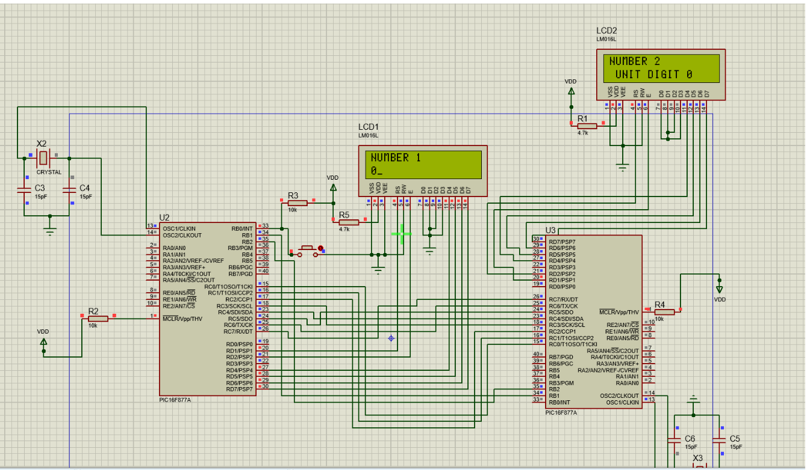

# PIC16F877A Multiplication Calculator (Master / Co-Processor)

> A two-microcontroller embedded calculator that multiplies two two-digit numbers entered via push button, displays prompts and the result on a 16×2 LCD, and offloads the multiplication itself to a slave PIC over a master ↔ co-processor link.



Built for the **Embedded Systems** course at Birzeit University, supervised by **Prof. Hanna Bullata**. Written entirely in PIC assembly using MPLAB IDE and simulated in Proteus.

---

## Tech Stack


---

## Highlights

- **Two-MCU architecture** — a master PIC handles I/O (push button, LCD, prompts) and dispatches the multiplication operands to a slave PIC.
- **Slave co-processor** — receives the two operands, performs the multiplication, and returns the result to the master for display.
- **Inter-MCU communication** — operands and results travel over a shared port-level bus, mapped out in the Proteus schematic.
- **User-friendly flow** — welcome message → "enter first number" → "enter second number" → result display.

---

## Repository Layout

```
.
├── README.md
├── main.asm                            # Master / slave assembly sources
├── mplab_master.rar                    # MPLAB project — master MCU
├── mplab_slave(co-processer).rar       # MPLAB project — slave MCU
├── protus.rar                          # Proteus simulation project
├── testCasesP3.txt                     # Sample test cases
├── testCase.mp4                        # Recorded run on the simulated hardware
├── screen of circuits.png              # Annotated schematic
└── docs/
    └── showcase.png                    # Hero schematic shot
```

---

## How to Build and Simulate

1. **Install** MPLAB IDE and Proteus.
2. **Open** the master and slave MPLAB project archives:

   ```text
   mplab_master.rar
   mplab_slave(co-processer).rar
   ```

3. **Compile** each project. The output HEX files are loaded into the corresponding PIC16F877A in the Proteus simulation:

   ```text
   protus.rar
   ```

4. **Run** the Proteus simulation. Use the push button to enter the first number, then the second, and watch the result on the master's LCD.

`testCase.mp4` and `testCasesP3.txt` document expected behaviour across a representative set of inputs.

---

## Course & Acknowledgements

- **Course:** Embedded Systems, Birzeit University
- **Supervisor:** Prof. Hanna Bullata
- **Hardware:** PIC16F877A (master + slave), 16×2 character LCD, push-button input
